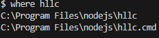

# How to Live and Learn on Campus 2024

This project is licensed under the How to Live and Learn on Campus Developer Team only.

## Getting Started

### Prerequisites

Ensure you have [Node.js](https://nodejs.org/) and [Yarn](https://yarnpkg.com/) installed. Additionally, make sure you have the [MongoDB server](https://www.mongodb.com/try/download/community) installed to interact with the database.

### Setup the project

Install project dependencies:

```bash
$ yarn install
```

Install the `hllc` CLI (please make sure you are in the root project directory):

```bash
$ npm i -g .
```

Set up all projects:

```bash
$ hllc setup
```

To install project dependencies, this command runs [yarn install](https://classic.yarnpkg.com/lang/en/docs/cli/install/) for each project:

```bash
# install all projects
$ hllc install

# install a specific project
$ hllc install <project>
```

### Project configuration

If you want to configure project settings after `hllc setup` is completed, you can run the following command:

```bash
# configure all projects
$ hllc config

# configure a specific project
$ hllc config <project>
```

### Start the Project

```bash
# run with project selection
$ hllc dev

# or specify a project in the CLI
$ hllc dev <project>
```

### Project deployment

Build all projects to prepare for deployment:

```bash
$ hllc build

# if you want to build a specific project
$ hllc build <project>
```

If you want to preview the production environment, run the following command:

```bash
$ hllc preview <project>
```

If you want to see the production-like application:

```bash
$ hllc start <project>
```

If you want to run all projects together using [pm2](https://pm2.keymetrics.io/):

```bash
$ hllc deploy
```

### PM2 Guide

To ensure you have run `hllc deploy` at least once, check the pm2 list with the following command:

```bash
$ pm2 ls
```

If the list exists, you can restart the project:

```bash
# restart all projects
$ pm2 restart all

# restart a specific project
$ pm2 restart <project>
```

Before running the `hllc deploy` command again, you must kill the process first:

```bash
$ pm2 kill
$ hllc deploy
```

### Uninstalling HLLC CLI

To remove the `hllc` command line from your machine, try the following command:

```bash
# searching for command line location
$ where hllc # or which hllc
```

Example:



Then remove the following (don't forget to replace `\` with `/` and add `""`):

```bash
$ rm -rf "C:/Program Files/nodejs/hllc"
$ rm -rf "C:/Program Files/nodejs/hllc.cmd"
```

## Other HLLC CLI

### Dependencies installation

To install dependencies easily, you can run the `hllc add` command. This command runs [yarn add](https://classic.yarnpkg.com/lang/en/docs/cli/add/) for each project:

```bash
$ hllc add <project> <package> [options]
```

Example:

Install dependencies in the `backend` project:

```bash
$ hllc add backend dotenv -D
```

### Linter tools

To run the linter, you can use the following commands:

```bash
# run linter
$ hllc lint

# run linter with fix options
$ hllc lint --fix
```
